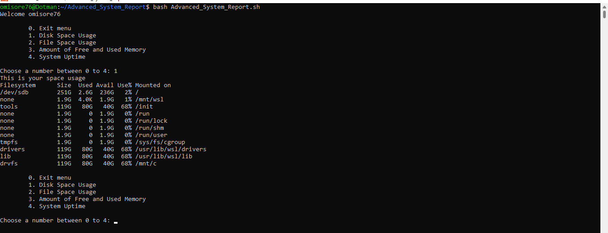
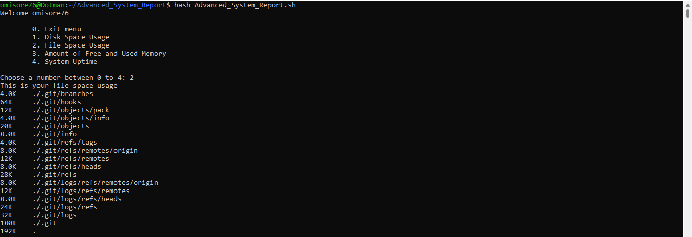
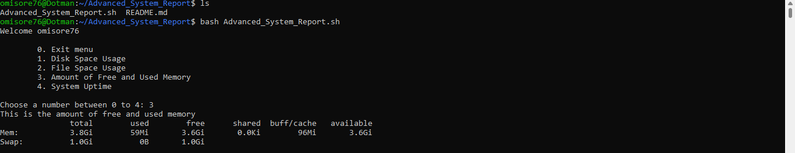
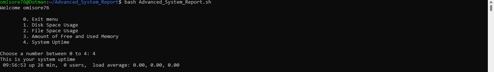

# Advanced_System_Report

## Project Aim

The aim of this project is to generate important information about your computer's performance.

## Introduction

This repository provides a bash script for generating advanced system reports. 

It contains a menu with four options, each configured to display different information about your computer. To choose an option, simply enter the corresponding number when prompted. 

Let's start with option 1, shall we? If you choose this option, you'll be able to see how much disk space is being used. This is handy if you're trying to figure out why your computer is running slow or if you're running out of space.



Option 2 is all about file space usage. This is useful for determining which programs take up the most space on your hard drive. If you're noticing your computer is sluggish, this is a good place to start investigating.



Option 3 will show you the amount of free and used memory on your system. This can be helpful if you're trying to figure out why your computer is crashing or trying to free up some memory.



And finally, option 4 will display the system uptime. This is handy if you're trying to figure out how long your computer has been running without crashing or if you're trying to troubleshoot a problem.



Entering 0 will exit the menu.

## How to Use The Repo
In order to use it, simply:

1) fork the repo and clone it onto your local machine. 

2) Navigate to the project directory

3) run the script by entering the command below into your terminal. 
```
bash Advanced_System_Report.sh
```

4) Finally, choose a number based on the system information you need.

Thank you!
